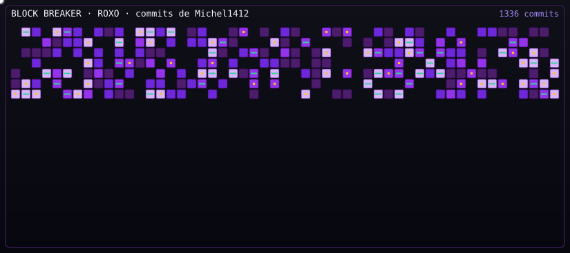
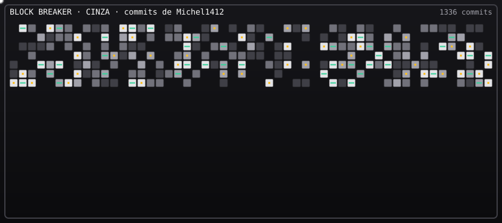
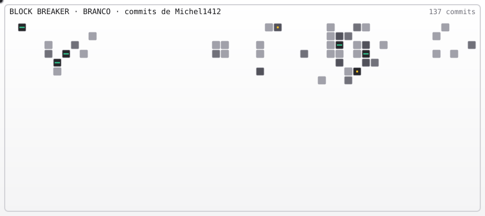
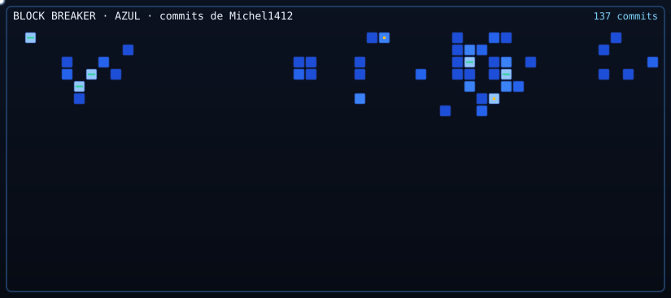
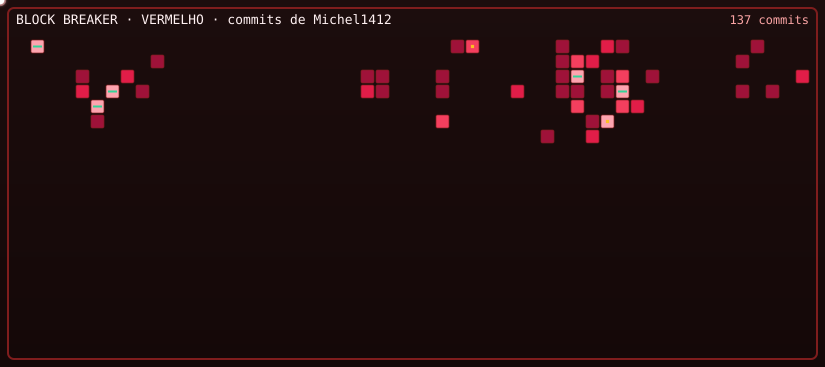
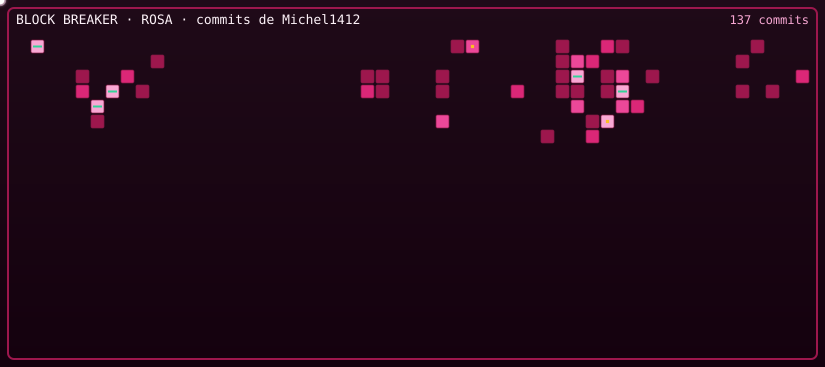
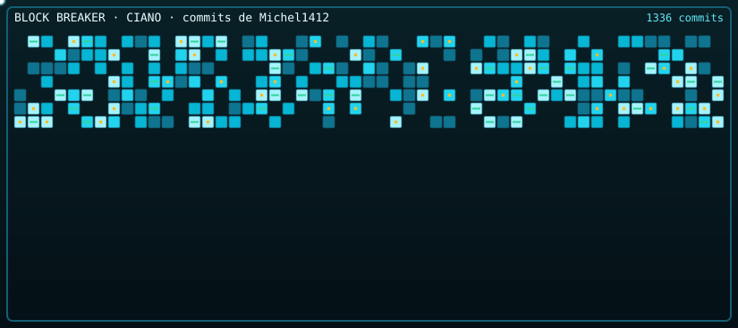
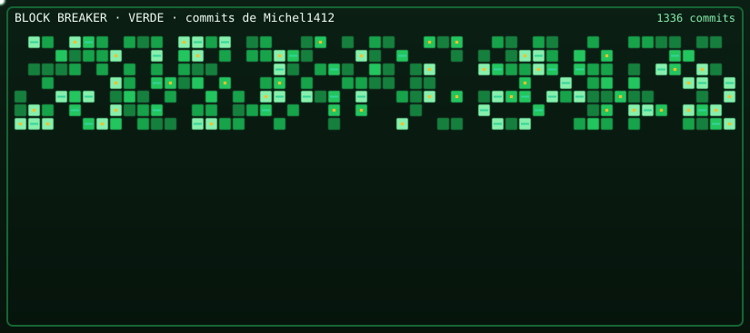
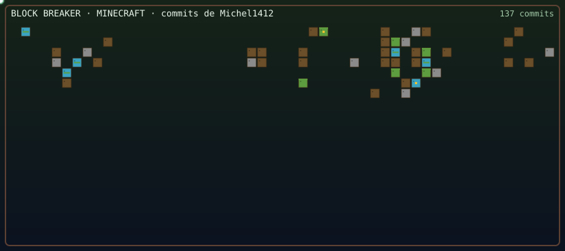

<p align="center">
  <a href="./dist/block-breaker.html">
    
  </a>
</p>

<p align="center">
  <strong>Commit Breaker</strong><br/>
  A fabrica publica de extensoes GitHub Actions.<br/>
  O grafico de contribuicoes do ultimo ano vira um <em>Block Breaker</em> no README.
</p>

<p align="center">
  <a href="https://github.com/Michel1412/commit-craft/blob/main/LICENSE"></a>
  <a href="#copie-e-cole-no-seu-readme"></a>
  <a href="#crie-um-tema"></a>
</p>

# Commit Breaker

No GitHub o README **nao roda JavaScript**. Por isso a fabrica gera dois arquivos: um SVG que joga sozinho na pagina do perfil, e um HTML para quem quiser pegar o controle.

Cole no seu repositorio, rode a Action uma vez, e a parede de tijolos passa a ser o seu ano de commits — no GitHub inteiro.

| Arquivo | Onde aparece | O que faz |
| --- | --- | --- |
| `dist/block-breaker.svg` | README | A plataforma joga sozinha e quebra a parede |
| `dist/block-breaker.html` | Clique / Pages | Partida de verdade, com teclado |

Sem foco, o automatico joga para ganhar. Clique no palco e a partida comeca na hora (3 vidas, bola ja em jogo). A/D ou setas movem. Clique fora e o automatico volta. Tijolos mais claros (mais commits) dropam bola extra ou plataforma larga.

## Temas

Sao 8 paletas basicas e 1 tema de jogo. Clique no preview para abrir a versao jogavel.

### Basicos

<table>
  <tr>
    <td align="center" width="50%">
      <p><strong>Roxo</strong> · <code>roxo</code> · default</p>
      <a href="./preview/roxo.html"></a>
    </td>
    <td align="center" width="50%">
      <p><strong>Cinza</strong> · <code>cinza</code></p>
      <a href="./preview/cinza.html"></a>
    </td>
  </tr>
  <tr>
    <td align="center" width="50%">
      <p><strong>Branco</strong> · <code>branco</code></p>
      <a href="./preview/branco.html"></a>
    </td>
    <td align="center" width="50%">
      <p><strong>Azul</strong> · <code>azul</code></p>
      <a href="./preview/azul.html"></a>
    </td>
  </tr>
  <tr>
    <td align="center" width="50%">
      <p><strong>Vermelho</strong> · <code>vermelho</code></p>
      <a href="./preview/vermelho.html"></a>
    </td>
    <td align="center" width="50%">
      <p><strong>Rosa</strong> · <code>rosa</code></p>
      <a href="./preview/rosa.html"></a>
    </td>
  </tr>
  <tr>
    <td align="center" width="50%">
      <p><strong>Ciano</strong> · <code>ciano</code></p>
      <a href="./preview/ciano.html"></a>
    </td>
    <td align="center" width="50%">
      <p><strong>Verde</strong> · <code>verde</code></p>
      <a href="./preview/verde.html"></a>
    </td>
  </tr>
</table>

### Games

<table>
  <tr>
    <td align="center">
      <p><strong>Minecraft</strong> · <code>minecraft</code></p>
      <a href="./preview/minecraft.html"></a>
    </td>
  </tr>
</table>

Troque o tema no input `theme` da Action, no `--theme` do CLI, ou na constante `THEME` em [`src/theme/index.js`](./src/theme/index.js).

## Copie e cole no seu README

O GitHub coloca um **botao de copiar** no canto de cada bloco. Use os dois: o workflow gera os arquivos, o Markdown cola o jogo na pagina.

### 1. Cole em `.github/workflows/commit-breaker.yml`

```yaml
name: commit-breaker

on:
  schedule:
    - cron: "0 8 * * *"
  workflow_dispatch:
  push:
    branches: [main]

jobs:
  generate:
    runs-on: ubuntu-latest
    permissions:
      contents: write
    steps:
      - uses: actions/checkout@v4

      - name: Generate Block Breaker
        uses: Michel1412/commit-craft@v1
        with:
          github_user_name: ${{ github.repository_owner }}
          github_token: ${{ secrets.GITHUB_TOKEN }}
          extension: block-breaker
          out_dir: dist
          # Temas:
          #   Basicos: roxo (default), cinza, branco, azul, vermelho, rosa, ciano, verde
          #   Games:   minecraft
          theme: roxo

      - name: Commit generated files
        run: |
          git config user.name "github-actions[bot]"
          git config user.email "41898282+github-actions[bot]@users.noreply.github.com"
          git add dist
          if git diff --cached --quiet; then
            echo "Sem mudanca visual"
            exit 0
          fi
          git commit -m "chore: regenera o Block Breaker dos commits anuais"
          git push
```

O mesmo arquivo esta em [`examples/add-to-your-repo.yml`](./examples/add-to-your-repo.yml).

### 2. Cole no `README.md`

```markdown
<p align="center">
  <a href="./dist/block-breaker.html">
    
  </a>
</p>
```

### 3. Rode uma vez

Actions → **commit-breaker** → **Run workflow**. No dia seguinte o cron atualiza sozinho.

Quer teclado publico? Settings → Pages → branch `main`, pasta `/dist`. O jogo fica em `https://SEU-USER.github.io/SEU-REPO/block-breaker.html`.

## Action

| Input | Padrao | Significado |
| --- | --- | --- |
| `github_user_name` | obrigatorio | Login cujo calendario anual vira tijolo |
| `github_token` | `github.token` | Le o calendario. Publico basta |
| `extension` | `block-breaker` | Peca da fabrica |
| `out_dir` | `dist` | Pasta relativa de saida |
| `source` | `user` | `user` = GitHub inteiro no ultimo ano. `repo` = um repositorio |
| `repository` | o repo da Action | Usado quando `source=repo` |
| `theme` | `roxo` | Paleta visual |

```bash
node src/cli.js --user SEU_LOGIN --token SEU_TOKEN --out dist --theme roxo
```

## Crie um tema

Este repositorio e publico de proposito: **faltam temas, e a gente quer os seus.**

Um tema novo e sobretudo uma paleta. Abra [`src/theme/index.js`](./src/theme/index.js), coloque o nome no comentario do topo e registre a paleta em `THEMES`:

```javascript
oceano: pack({
  id: "oceano",
  name: "Oceano",
  group: "basicos", // ou "games"
  background: "#020617",
  court: "#0b1f33",
  frame: "#155e75",
  paddle: "#ecfeff",
  paddleEdge: "#22d3ee",
  ballGlow: "#67e8f9",
  hud: "#ecfeff",
  hudMuted: "#67e8f9",
  life: "#22d3ee",
  levels: ["#082f49", "#0369a1", "#0284c7", "#22d3ee", "#a5f3fc"],
  brickHi: "#cffafe",
  brickLo: "#155e75",
}),
```

Depois:

1. Rode `node preview/build.mjs` e abra `preview/index.html`
2. Se o tema tiver identidade propria (como o Minecraft), da para ir alem da paleta — textura, HUD, moldura
3. Abra um Pull Request com o nome do tema e um print ou o SVG gerado

PRs de paleta pequena tambem valem. Se voce so tem um mood board, manda mesmo assim.

## Licenca

MIT. Use, forke, remix. O grafico e seu; o jogo, da comunidade.
