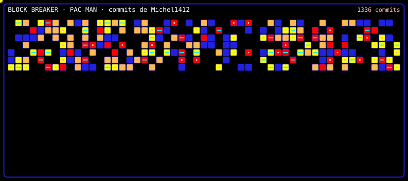
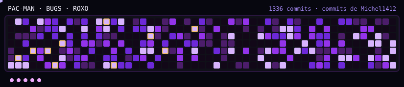
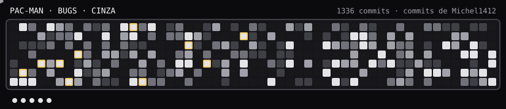
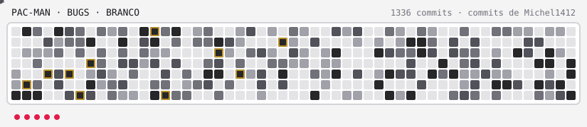
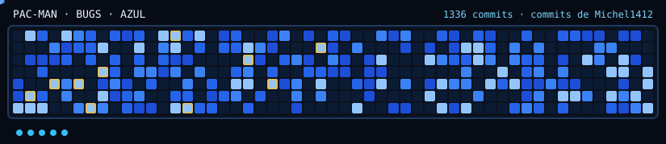
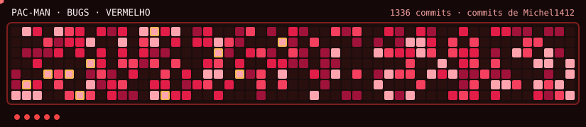
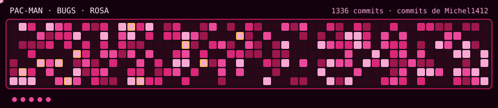
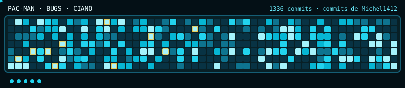
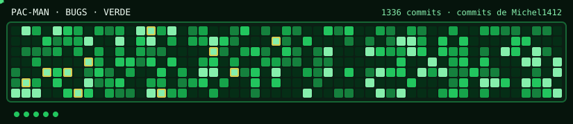
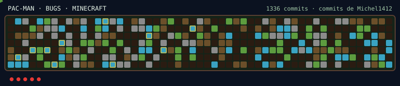

<p align="center">
  <a href="./dist/block-breaker.html">
    
  </a>
</p>

<p align="center">
  <a href="./dist/pac-man.html">
    
  </a>
</p>

<p align="center">
  <strong>Commit Breaker</strong><br/>
  O grafico de contribuicoes do ultimo ano vira jogos no README.
</p>

<p align="center">
  <a href="https://github.com/Michel1412/commit-craft/blob/main/LICENSE"></a>
  <a href="#copie-e-cole-no-seu-readme"></a>
  <a href="#temas"></a>
</p>

# Commit Breaker

No GitHub o README **nao roda JavaScript**. Por isso cada jogo gera dois arquivos: um SVG que joga sozinho na pagina do perfil, e um HTML para quem quiser pegar o controle.

Cole no seu repositorio, rode a Action uma vez, e o seu ano de commits vira um jogo — no GitHub inteiro.

A fabrica publica **dois jogos**, com os **mesmos temas**. A galeria ao vivo esta em [`preview/index.html`](./preview/index.html).

| Jogo | Extensao | Tema oficial | Objetivos | Extra |
| --- | --- | --- | --- | --- |
| Block Breaker | `block-breaker` | `roxo` | Tijolos = dias com commit | Bonus nos dias mais quentes |
| Pac-Man | `pac-man` | `pacman` | Come os dias com commit | 4 Bugs, 5 vidas, 10 dias especiais (5s) |

| Arquivo | Onde aparece | O que faz |
| --- | --- | --- |
| `dist/block-breaker.svg` / `dist/pac-man.svg` | README | O automatico joga sozinho |
| `dist/block-breaker.html` / `dist/pac-man.html` | Clique / Pages | Partida de verdade, com teclado |

Sem foco, o automatico joga para ganhar. Clique no palco e a partida comeca na hora. Clique fora e o automatico volta.

### Block Breaker

3 vidas, bola ja em jogo. A/D ou setas. Tijolos mais claros dropam bola extra ou plataforma larga.

<p align="center">
  <a href="./dist/block-breaker.html">
    
  </a>
</p>

### Pac-Man

O plano e o **calendario de contribuicoes**. Pac-Man anda nos dias vazios e come os dias com commit. Comeca com 4 Bugs (cada um com um alvo diferente). Os 10 dias com mais commits sao especiais (5s comendo Bugs). 5 vidas; ao perder, Pac e Bugs voltam ao inicio e os blocos ja comidos continuam. WASD ou setas.

<p align="center">
  <a href="./dist/pac-man.html">
    
  </a>
</p>

## Temas

Sao 8 paletas basicas e 2 temas de jogo. Os temas valem para **os dois jogos**. Clique no preview para abrir a versao jogavel. Galeria completa: [`preview/`](./preview/index.html).

### Block Breaker

<table>
  <tr>
    <td align="center" width="50%">
      <p><strong>Roxo</strong> · <code>roxo</code> · default</p>
      <a href="./preview/roxo.html"></a>
    </td>
    <td align="center" width="50%">
      <p><strong>Cinza</strong> · <code>cinza</code></p>
      <a href="./preview/cinza.html"></a>
    </td>
  </tr>
  <tr>
    <td align="center" width="50%">
      <p><strong>Branco</strong> · <code>branco</code></p>
      <a href="./preview/branco.html"></a>
    </td>
    <td align="center" width="50%">
      <p><strong>Azul</strong> · <code>azul</code></p>
      <a href="./preview/azul.html"></a>
    </td>
  </tr>
  <tr>
    <td align="center" width="50%">
      <p><strong>Vermelho</strong> · <code>vermelho</code></p>
      <a href="./preview/vermelho.html"></a>
    </td>
    <td align="center" width="50%">
      <p><strong>Rosa</strong> · <code>rosa</code></p>
      <a href="./preview/rosa.html"></a>
    </td>
  </tr>
  <tr>
    <td align="center" width="50%">
      <p><strong>Ciano</strong> · <code>ciano</code></p>
      <a href="./preview/ciano.html"></a>
    </td>
    <td align="center" width="50%">
      <p><strong>Verde</strong> · <code>verde</code></p>
      <a href="./preview/verde.html"></a>
    </td>
  </tr>
  <tr>
    <td align="center" width="50%">
      <p><strong>Minecraft</strong> · <code>minecraft</code></p>
      <a href="./preview/minecraft.html"></a>
    </td>
    <td align="center" width="50%">
      <p><strong>Pac-Man</strong> · <code>pacman</code></p>
      <a href="./preview/pacman.html"></a>
    </td>
  </tr>
</table>

### Pac-Man

<table>
  <tr>
    <td align="center" width="50%">
      <p><strong>Roxo</strong> · <code>roxo</code></p>
      <a href="./preview/pac-man/roxo.html"></a>
    </td>
    <td align="center" width="50%">
      <p><strong>Cinza</strong> · <code>cinza</code></p>
      <a href="./preview/pac-man/cinza.html"></a>
    </td>
  </tr>
  <tr>
    <td align="center" width="50%">
      <p><strong>Branco</strong> · <code>branco</code></p>
      <a href="./preview/pac-man/branco.html"></a>
    </td>
    <td align="center" width="50%">
      <p><strong>Azul</strong> · <code>azul</code></p>
      <a href="./preview/pac-man/azul.html"></a>
    </td>
  </tr>
  <tr>
    <td align="center" width="50%">
      <p><strong>Vermelho</strong> · <code>vermelho</code></p>
      <a href="./preview/pac-man/vermelho.html"></a>
    </td>
    <td align="center" width="50%">
      <p><strong>Rosa</strong> · <code>rosa</code></p>
      <a href="./preview/pac-man/rosa.html"></a>
    </td>
  </tr>
  <tr>
    <td align="center" width="50%">
      <p><strong>Ciano</strong> · <code>ciano</code></p>
      <a href="./preview/pac-man/ciano.html"></a>
    </td>
    <td align="center" width="50%">
      <p><strong>Verde</strong> · <code>verde</code></p>
      <a href="./preview/pac-man/verde.html"></a>
    </td>
  </tr>
  <tr>
    <td align="center" width="50%">
      <p><strong>Minecraft</strong> · <code>minecraft</code></p>
      <a href="./preview/pac-man/minecraft.html"></a>
    </td>
    <td align="center" width="50%">
      <p><strong>Pac-Man</strong> · <code>pacman</code> · oficial</p>
      <a href="./preview/pac-man/pacman.html"></a>
    </td>
  </tr>
</table>

Troque o tema no input `theme` da Action, no `--theme` do CLI, ou na constante `THEME` em [`src/theme/index.js`](./src/theme/index.js).

## Copie e cole no seu README

O GitHub coloca um **botao de copiar** no canto de cada bloco. Use os dois: o workflow gera os arquivos, o Markdown cola os jogos na pagina.

### 1. Cole em `.github/workflows/commit-breaker.yml`

```yaml
name: commit-breaker

on:
  schedule:
    - cron: "0 8 * * *"
  workflow_dispatch:
  push:
    branches: [main]

jobs:
  generate:
    runs-on: ubuntu-latest
    permissions:
      contents: write
    steps:
      - uses: actions/checkout@v4

      - name: Generate Block Breaker
        uses: Michel1412/commit-craft@v2
        with:
          github_user_name: ${{ github.repository_owner }}
          github_token: ${{ secrets.GITHUB_TOKEN }}
          extension: block-breaker
          out_dir: dist
          theme: roxo

      - name: Generate Pac-Man
        uses: Michel1412/commit-craft@v2
        with:
          github_user_name: ${{ github.repository_owner }}
          github_token: ${{ secrets.GITHUB_TOKEN }}
          extension: pac-man
          out_dir: dist
          theme: pacman

      - name: Commit generated files
        run: |
          git config user.name "github-actions[bot]"
          git config user.email "41898282+github-actions[bot]@users.noreply.github.com"
          git add dist
          if git diff --cached --quiet; then
            echo "Sem mudanca visual"
            exit 0
          fi
          git commit -m "chore: regenera os jogos dos commits anuais"
          git push
```

O mesmo arquivo esta em [`examples/add-to-your-repo.yml`](./examples/add-to-your-repo.yml).

Temas:

- Basicos: `roxo` (default do Block Breaker), `cinza`, `branco`, `azul`, `vermelho`, `rosa`, `ciano`, `verde`
- Games: `minecraft`, `pacman` (oficial do Pac-Man)

### 2. Cole no `README.md`

```markdown
<p align="center">
  <a href="./dist/block-breaker.html">
    
  </a>
</p>

<p align="center">
  <a href="./dist/pac-man.html">
    
  </a>
</p>
```

Quer so um jogo? Gere e cole so o par `.svg` / `.html` dele. Os nomes ficam em `dist/README.embed.md` depois da Action.

### 3. Rode uma vez

Actions → **commit-breaker** → **Run workflow**. No dia seguinte o cron atualiza sozinho.

Quer teclado publico? Settings → Pages → branch `main`, pasta `/dist`. Os jogos ficam em:

- `https://SEU-USER.github.io/SEU-REPO/block-breaker.html`
- `https://SEU-USER.github.io/SEU-REPO/pac-man.html`

## Action

| Input | Padrao | Significado |
| --- | --- | --- |
| `github_user_name` | obrigatorio | Login cujo calendario anual vira o jogo |
| `github_token` | `github.token` | Le o calendario. Publico basta |
| `extension` | `block-breaker` | `block-breaker` ou `pac-man` |
| `out_dir` | `dist` | Pasta relativa de saida |
| `source` | `user` | `user` = GitHub inteiro no ultimo ano. `repo` = um repositorio |
| `repository` | o repo da Action | Usado quando `source=repo` |
| `theme` | `roxo` | Paleta visual. No Pac-Man o oficial e `pacman` |

Cada chamada da Action gera **um** jogo. Para os dois no README, rode os dois steps (como no workflow acima).

```bash
node src/cli.js --user SEU_LOGIN --token SEU_TOKEN --out dist --extension block-breaker --theme roxo
node src/cli.js --user SEU_LOGIN --token SEU_TOKEN --out dist --extension pac-man --theme pacman
```

## Crie um tema

Este repositorio e publico de proposito: **faltam temas, e a gente quer os seus.**

Um tema novo e sobretudo uma paleta. Abra [`src/theme/index.js`](./src/theme/index.js), coloque o nome no comentario do topo e registre a paleta em `THEMES`:

```javascript
oceano: pack({
  id: "oceano",
  name: "Oceano",
  group: "basicos", // ou "games"
  background: "#020617",
  court: "#0b1f33",
  frame: "#155e75",
  paddle: "#ecfeff",
  paddleEdge: "#22d3ee",
  ballGlow: "#67e8f9",
  hud: "#ecfeff",
  hudMuted: "#67e8f9",
  life: "#22d3ee",
  levels: ["#082f49", "#0369a1", "#0284c7", "#22d3ee", "#a5f3fc"],
  brickHi: "#cffafe",
  brickLo: "#155e75",
}),
```

Depois:

1. Rode `node preview/build.mjs` e abra `preview/index.html` (os dois jogos, todos os temas)
2. Se o tema tiver identidade propria (como o Minecraft), da para ir alem da paleta — textura, HUD, moldura
3. Abra um Pull Request com o nome do tema e um print ou o SVG gerado

PRs de paleta pequena tambem valem. Se voce so tem um mood board, manda mesmo assim.

## Licenca

MIT. Use, forke, remix. O grafico e seu; o jogo, da comunidade.

O historico de versoes esta no [CHANGELOG](./CHANGELOG.md) (padrao v1.0.0).
